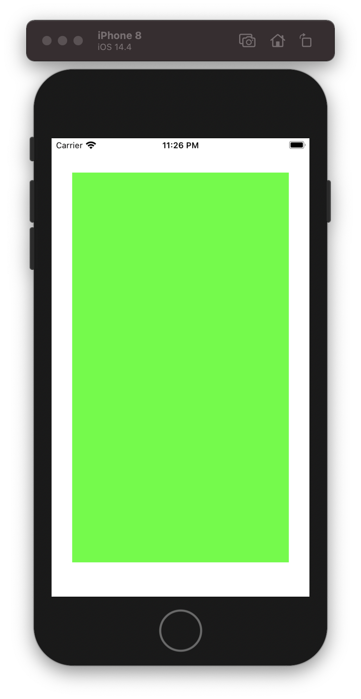

# PinAnchor

# Usage 

## Quick Start

```swift

import PinAnchor

let greenView = UIView()
greenView.backgroundColor = .green
view.addSubview(greenView)
greenView.translatesAutoresizingMaskIntoConstraints = false

greenView
    .pinToTop(inset: 50)
    .pinToLeft(inset: 30)
    .pinToRight(inset: 30)
    .pinToBottom(inset: 50)
```

<div align="center"></div>

# Installation

## CocoaPods 

```
pod 'PinAnchor', '~> 1.0'
```


PinAnchor is released under the MIT license.
